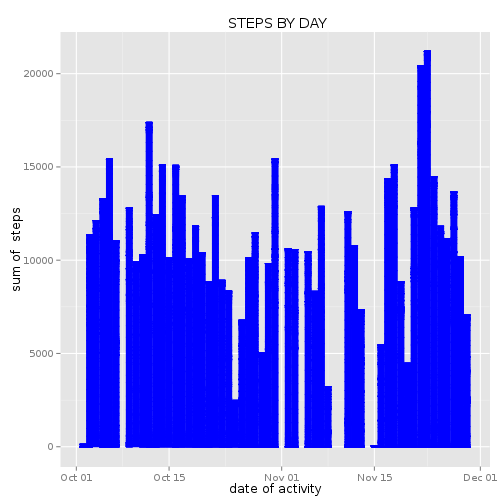
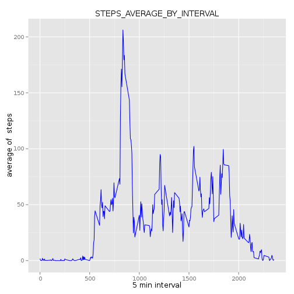
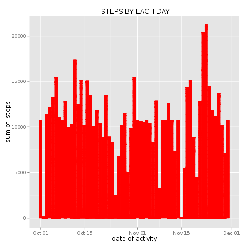
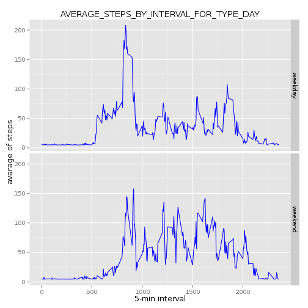

##STEP 1. Loading and preprocessing the data##################################
######################################################################################
1) Load data:

```r
activity_data<-read.csv("activity.csv", sep = ",", header =TRUE, 
                        colClasses =c ("integer", "Date", "numeric"))
```

```r
View (activity_data)
```

```r
str (activity_data)
```

```
## 'data.frame':	17568 obs. of  3 variables:
##  $ steps   : int  NA NA NA NA NA NA NA NA NA NA ...
##  $ date    : Date, format: "2012-10-01" "2012-10-01" ...
##  $ interval: num  0 5 10 15 20 25 30 35 40 45 ...
```
2) Tranform data:

```r
activity_data_1<-na.omit (activity_data)
str(activity_data_1)
```

```
## 'data.frame':	15264 obs. of  3 variables:
##  $ steps   : int  0 0 0 0 0 0 0 0 0 0 ...
##  $ date    : Date, format: "2012-10-02" "2012-10-02" ...
##  $ interval: num  0 5 10 15 20 25 30 35 40 45 ...
##  - attr(*, "na.action")=Class 'omit'  Named int [1:2304] 1 2 3 4 5 6 7 8 9 10 ...
##   .. ..- attr(*, "names")= chr [1:2304] "1" "2" "3" "4" ...
```
##STEP 2. What is mean total number of steps taken per day?####################
#######################################################################################
1) Calculate the total number of steps taken per day

```r
steps_by_day<-aggregate(activity_data_1$steps ~ activity_data_1$date,  FUN =sum)
str(steps_by_day)
```

```
## 'data.frame':	53 obs. of  2 variables:
##  $ activity_data_1$date : Date, format: "2012-10-02" "2012-10-03" ...
##  $ activity_data_1$steps: int  126 11352 12116 13294 15420 11015 12811 9900 10304 17382 ...
```

```r
head(steps_by_day)
```

```
##   activity_data_1$date activity_data_1$steps
## 1           2012-10-02                   126
## 2           2012-10-03                 11352
## 3           2012-10-04                 12116
## 4           2012-10-05                 13294
## 5           2012-10-06                 15420
## 6           2012-10-07                 11015
```

```r
colnames(steps_by_day) <- c("date_activity","steps")
head(steps_by_day)
```

```
##   date_activity steps
## 1    2012-10-02   126
## 2    2012-10-03 11352
## 3    2012-10-04 12116
## 4    2012-10-05 13294
## 5    2012-10-06 15420
## 6    2012-10-07 11015
```
2) Make a histogram of the total number of steps taken each day


```r
library (ggplot2)

plot_1<-ggplot(activity_data_1, aes (x= date, y= steps)) + 
  geom_histogram (stat = "identity", binwidth =2000 ,color= "blue", fill = "blue")+
             labs (title=" STEPS BY DAY", x = "date of activity", y = "sum of  steps")
print (plot_1)
```

 
######### ***Fig. 1 Sum of steps per day of activity*** ##############
######################################################################
3) Calculate and report the mean and median of the total number of steps taken per day

```r
steps_mean<-mean(steps_by_day$steps)
steps_mean
```

```
## [1] 10766.19
```

```r
steps_median <- median(steps_by_day$steps)
steps_median
```

```
## [1] 10765
```

##STEP 3. What is the average daily activity pattern?###########################
#########################################################################################
1) Make a time series plot (i.e. type = "l") 
of the 5-minute interval (x-axis) and the average number 
of steps taken, averaged across all days (y-axis)


```r
steps_average<-aggregate(x=list(activity_data_1$steps),by=list(activity_data_1$interval), FUN = mean, na.rm=TRUE)

str(steps_average)
```

```
## 'data.frame':	288 obs. of  2 variables:
##  $ Group.1                                                       : num  0 5 10 15 20 25 30 35 40 45 ...
##  $ c.0L..0L..0L..0L..0L..0L..0L..0L..0L..0L..0L..0L..0L..0L..0L..: num  1.717 0.3396 0.1321 0.1509 0.0755 ...
```

```r
head(steps_average)
```

```
##   Group.1 c.0L..0L..0L..0L..0L..0L..0L..0L..0L..0L..0L..0L..0L..0L..0L..
## 1       0                                                      1.7169811
## 2       5                                                      0.3396226
## 3      10                                                      0.1320755
## 4      15                                                      0.1509434
## 5      20                                                      0.0754717
## 6      25                                                      2.0943396
```

```r
colnames(steps_average) <- c("interval","steps")
head(steps_average)
```

```
##   interval     steps
## 1        0 1.7169811
## 2        5 0.3396226
## 3       10 0.1320755
## 4       15 0.1509434
## 5       20 0.0754717
## 6       25 2.0943396
```

```r
library (ggplot2)
plot_2<-ggplot(data = steps_average, aes (x= steps_average$interval , y=steps_average$steps), label = steps_average$interval)+ 
  geom_line ( color= "blue", pch=22, lty=1)+
  labs (title= "STEPS_AVERAGE_BY_INTERVAL",  x = "5 min interval",   y = "average of  steps") 

print (plot_2)
```

 
######### ***Fig. 2 Average of steps per interval of activity*** ##############
###############################################################################
2) Which 5-minute interval, on average across all the days in the dataset, contains 
   the maximum number of steps?

```r
max_steps_average_by_interval <- steps_average[which.max(steps_average$steps),1]
max_steps_average_by_interval
```

```
## [1] 835
```
## STEP 4. Imputing missing values##################################################
###############################################################################################
1)Calculate and report the total number of missing values in the dataset 
 (i.e. the total number of rows with NAs)

```r
activity_data_with_NA <- sum(is.na(activity_data))
activity_data_with_NA
```

```
## [1] 2304
```
2) Devise a strategy for filling in all of the missing values in the dataset. 
   The strategy does not need to be sophisticated. For example, you could use the mean/median 
   for that day, or the mean for that 5-minute interval,etc
   Find the NA positions


```r
NA_position <- which(is.na(activity_data$steps))
head (NA_position)
```

```
## [1] 1 2 3 4 5 6
```
vector of means


```r
means_Na_pos <- rep(mean(activity_data$steps, na.rm=TRUE), times=length(NA_position))
head(means_Na_pos)
```

```
## [1] 37.3826 37.3826 37.3826 37.3826 37.3826 37.3826
```
3) Create a new dataset that is equal to the original dataset 
   but with the missing data filled in

```r
activity_data[NA_position, "steps"] <- means_Na_pos
head(activity_data)
```

```
##     steps       date interval
## 1 37.3826 2012-10-01        0
## 2 37.3826 2012-10-01        5
## 3 37.3826 2012-10-01       10
## 4 37.3826 2012-10-01       15
## 5 37.3826 2012-10-01       20
## 6 37.3826 2012-10-01       25
```

4)
4.1)Make a histogram of the total number of steps taken each day 

```r
steps_each_day<-aggregate(activity_data$steps ~ activity_data$date,  FUN =sum)
str(steps_each_day)
```

```
## 'data.frame':	61 obs. of  2 variables:
##  $ activity_data$date : Date, format: "2012-10-01" "2012-10-02" ...
##  $ activity_data$steps: num  10766 126 11352 12116 13294 ...
```

```r
head(steps_each_day)
```

```
##   activity_data$date activity_data$steps
## 1         2012-10-01            10766.19
## 2         2012-10-02              126.00
## 3         2012-10-03            11352.00
## 4         2012-10-04            12116.00
## 5         2012-10-05            13294.00
## 6         2012-10-06            15420.00
```

```r
colnames(steps_each_day) <- c("date_activity","steps")
head(steps_each_day)
```

```
##   date_activity    steps
## 1    2012-10-01 10766.19
## 2    2012-10-02   126.00
## 3    2012-10-03 11352.00
## 4    2012-10-04 12116.00
## 5    2012-10-05 13294.00
## 6    2012-10-06 15420.00
```


```r
library (ggplot2)
plot_3<-ggplot(activity_data, aes (x= date, y= steps))+ geom_histogram (stat = "identity", binwidth =2000 ,color= "red", fill = "red")+
  labs (title=" STEPS BY EACH DAY", x = "date of activity", y = "sum of  steps")
print (plot_3)
```

 
######### ***Fig. 3 Sum of steps per each day*** ##############
###############################################################################

4.2) Calculate and report the mean and median total number of steps taken per day.

```r
mean_steps_each_day<-mean(steps_each_day$steps)
mean_steps_each_day
```

```
## [1] 10766.19
```

```r
median_steps_each_day<-median(steps_each_day$steps)
median_steps_each_day
```

```
## [1] 10766.19
```
Here, the  values, mean_steps_each_day and median_steps_each_day differ  from mean_steps
and midian_steps ( part "STEP 2"), respectively. Because, the imputing missing values provide
to more larger data set.

##STEP 5. Are there differences in activity patterns between weekdays and weekends?########
############################################################################################
1) Create a new factor variable in the dataset with two levels – “weekday” and “weekend” 
  indicating whether a given date is a weekday or weekend day.

```r
activity_data$dateType <-  ifelse(as.POSIXlt(activity_data$date)$wday %in% c(0,6), 'weekend', 'weekday')
head (activity_data$dateType)
```

```
## [1] "weekday" "weekday" "weekday" "weekday" "weekday" "weekday"
```
  2) Make a panel plot containing a time series plot


```r
activity_data_average <- aggregate(steps ~ interval + dateType, data=activity_data, FUN = mean)
```

```r
plot_4 = ggplot(activity_data_average, aes(interval, steps)) + 
  geom_line(color= "blue", pch=22, lty=1) + 
  facet_grid(dateType ~ .)+ 
  labs (title = "AVERAGE_STEPS_BY_INTERVAL_FOR_TYPE_DAY", x = "5-min interval", y = "avarage of steps")

print (plot_4)
```

 
####### ***Fig. 4 Average of steps per interveachl for two type day*** #######
###############################################################################
